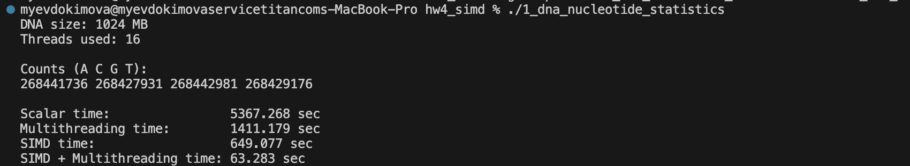
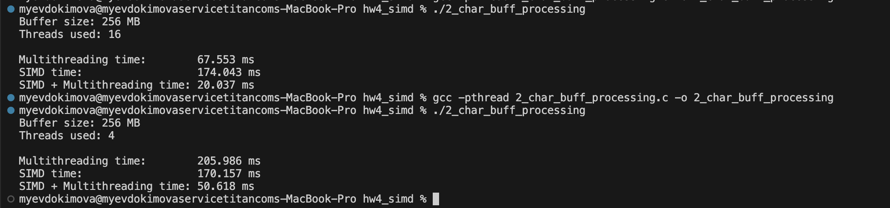

# Homework 4: Report

**Platform:** Apple M4 Max, 16 threads, no virtual multithreading

## Task 1: DNA Nucleotide Counting

The program generates a 1024 MB buffer filled with random A, C, G, T characters and counts how many times each one appears using four approaches.
1. **Scalar**: simple for loop that checks each byte one by one with if/else and increments a counter.
2. **Multithreading**: the buffer is split into 16 equal chunks (one per hardware thread). Each thread runs the same scalar counting on its chunk, stores results locally, then locks a mutex and adds its counts to the shared global variables.
3. **SIMD**: processes 16 bytes at a time using 128-bit NEON vectors. Firstly I broadcast each char into a vector, compare against the loaded data with vceqq_u8, and accumulate matches by subtracting the comparison result (0xFF = -1, so subtracting adds 1). Since accumulators are 8-bit, I flush every 255 iterations using vaddlvq_u8 to avoid overflow. Leftover bytes are processed by scalar function.
4. **SIMD and Mulithreading**: The same logic as for multithreading with chunk splitting but here instead of calling count_scalar function in each thread, I call count_simd.

_Results:_

## Task 2: Lowercase to Uppercase Conversion

The program generates a 256 MB buffer of random ASCII characters and converts all lowercase letters to uppercase in-place using three aproaches.
1. **Multithreading**: the buffer is split into 16 equal chunks (one per hardware thread). No mutex needed here since each thread only writes to its own chunk.
2. **SIMD**: loads 16 bytes, checks if each byte is >= 'a' AND <= 'z' using `vcgeq_u8` and `vcleq_u8`, ANDs the results to get a mask, ANDs the mask with 32 to get the subtraction value, subtracts it from the data. Only lowercase bytes get modified, everything else stays the same. Writes results back with `vst1q_u8`.
3. **SIMD and Mulithreading**: The same logic as for multithreading with chunk splitting but here I call `to_upper_simd`.

Here results are a little bit different with 16 threads and 4 threads, with 16 threads multithreaded implementation is better compared to SIMD, because 16 cores running scalar code in parallel simply outpace a single core doing 16 bytes at a time with NEON. With only 4 threads, SIMD wins since 4 scalar workers can't match the throughput of one core processing 16 bytes per iteration.

_Results:_

