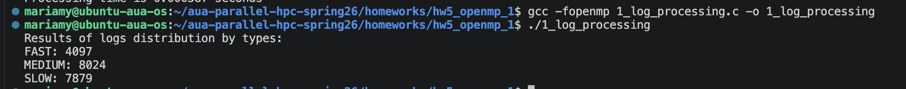
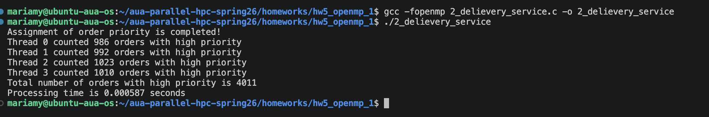

# Homework 5: Report

## Task 1: Parallel Log Processing

Used `#pragma omp single nowait` to initialize all logs on one thread, followed by an explicit `#pragma omp barrier` to ensure all threads wait until initialization is complete. Using `single` without `nowait` would achieve the same thing due to its implicit barrier, but the assignment required both single and barrier separately.
For classification each thread counts FAST, MEDIUM, and SLOW logs into a padded 2D array (`int log_count[N_THREADS][16]`), padding each row to 64 bytes avoids false sharing, where threads writing to adjacent memory locations cause constant cache invalidation between cores. Got thread ids so each thread can store its counts in its own slot in the padded array.
Used an `enum` for log types with `N_LOG_TYPE` as the last value, so the count updates automatically if new categories are added.
Final summation is done sequentially in a `single` block. Checked how many threads the system actually allocated to use that number when producing the final results.

_Results:_

## Task 2: Delivery Priority Update

Tested with cache-line padding on `thread_high_count` (`int thread_high_count[4][16]`) and observed ~1.5x speedup from avoiding false sharing on 10k orders, but kept the plain array to match the assignment specifications.
Initialized threshold via `#pragma omp single`, all other threads wait since single has an implicit barrier at the end. Setting threshold inside `single` instead of a `#define` feels unnecessary but the assignment required it.
Used `#pragma omp for` for initializing orders and assigning priority based on the defined threshold. Since no scheduler is specified, `static scheduling without a chunk size` uses block distribution, so false sharing can only occur at block boundaries (at most 3 times for 4 threads), which is negligible.
Got thread ids so each thread can store its high priority count in its own slot in.
Checked how many threads the system actually provided despite what was requested, to use that number when processing the total count of high priority orders.

_Results:_

