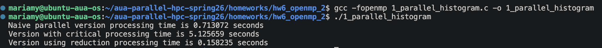
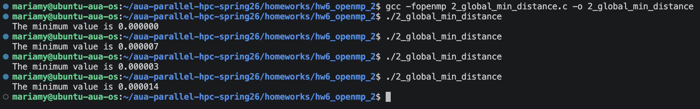
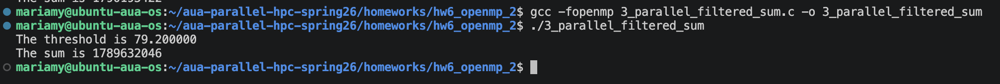

# Homework 6: Report

## Task 1: Parallel Histogram with Reduction

_Results:_

## Task 2: Global Minimum Distance (Closest Pair)

_Results:_

## Task 3: Parallel Filtered Sum (Top-K Style)

_Results:_

